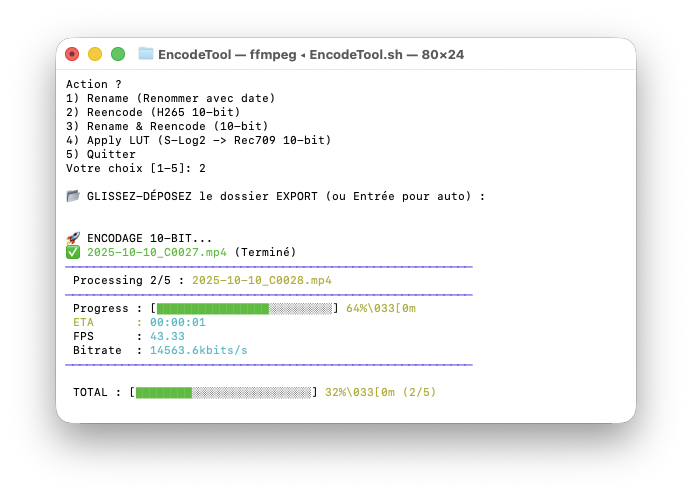

# 🎬 EncodeTool

**EncodeTool** is a blazing fast and aesthetic CLI (Command Line Interface) utility to automate batch video processing on macOS. It is designed to simplify the workflow of content creators by handling renaming, encoding, and color grading in a single command.



## ✨ Features

*   **⚡️ H.265 10-bit Encoding**: Mass conversion to HEVC (Main10) codec using Apple Silicon hardware acceleration (VideoToolbox).
*   **🎨 3D LUT Application**: Native support for converting LOG profiles (e.g., S-Log2) to Rec.709 directly integrated into the encoding pipeline.
*   **📅 Smart Renaming**: Automatically adds the original creation date (metadata) to the filename for perfect chronological sorting.
*   **📊 "Premium" UI**:
    *   Smooth progress bar for the current file (with ETA, FPS, Bitrate).
    *   Persistent global progress bar for batch tracking.
    *   Automatic terminal cleanup ("Collapsing" display) for a clean history.

## 🛠 Prerequisites

*   macOS (Optimized for Apple Silicon M1/M2/M3).
*   `ffmpeg` with `hevc_videotoolbox` support.
*   `zsh` (Default shell on macOS).

## ⚙️ Configuration

Before using the **Apply LUT** feature, you **MUST** edit the `EncodeTool.sh` file:
1.  Open `EncodeTool.sh` in a text editor.
2.  Locate `LUT_PATH='/path/to/your/LUT.cube'`.
3.  Replace it with the absolute path to your `.cube` LUT file.

## 🚀 Usage

1.  Navigate to the script directory:
    ```bash
    cd EncodeTool
    ```
2.  Run the script:
    ```bash
    ./EncodeTool.sh
    ```
3.  Follow the interactive interface:
    *   Drag and drop your source folder.
    *   Choose an action (Rename, Encode, Apply LUT...).
    *   Enjoy the magic.

## 🧠 "Vibecoding" & Philosophy

This project was built using **Vibecoding**.

> **What is Vibecoding?**
> It's a modern development approach where the coder "pair-programs" with an advanced AI in real-time. The focus is not on laborious syntax, but on intent, "flow" (the vibe), and rapid feature validation.

*   **Speed**: From idea to production in record time.
*   **Design**: AI generated the terminal GUI concepts (colors, layout) for an immediate "Premium" look.
*   **Robustness**: Code (especially complex math calculations in `awk` for the progress bar) was generated, tested, and bulletproofed against crashes through rapid iterations.

*Developed with ❤️ by Si0ul.*
