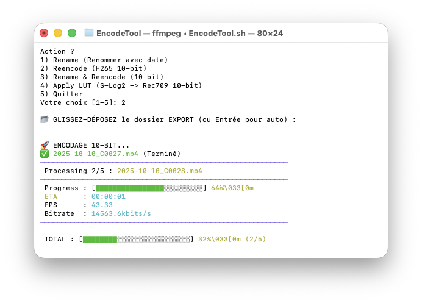
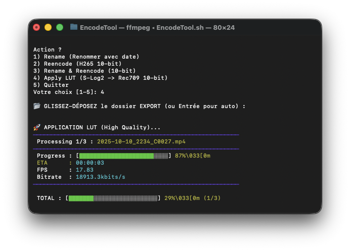

# 🎬 EncodeTool (Rust Edition)

**EncodeTool** is a blazing fast and aesthetic CLI (Command Line Interface) utility to automate batch video processing on macOS. Rewritten in **Rust**, it is designed to simplify the workflow of content creators by handling renaming, encoding, and color grading with high performance and reliability.

<div style="display: flex; justify-content: center; align-items: flex-start; gap: 10px;">
  
  
</div>

## ✨ Features

*   **⚡️ H.265 10-bit Encoding**: Mass conversion to HEVC (Main10) codec using Apple Silicon hardware acceleration (`hevc_videotoolbox`).
*   **🎨 3D LUT Application**: Native support for converting LOG profiles (e.g., S-Log2) to Rec.709 directly integrated into the encoding pipeline.
*   **📅 Smart Renaming**: Automatically prefixes the modification date (`YYYY-MM-DD_HHMM_`) to filenames based on file metadata.
*   **📊 Robust Progress**: 
    *   **Console Mode**: Interactive progress bar with file and global percentage.
    *   **JSONL Mode**: Structured output for integration with UIs or external logs.
*   **🛡️ Safety**: Includes `--dry-run` to preview actions and `--overwrite` to control output behavior.
*   **🕒 Metadata Preservation**: Automatically copies `mtime` and `atime` from source to exported files.

## 🛠 Prerequisites

*   **macOS** (Optimized for Apple Silicon).
*   **FFmpeg**: Must be installed with `hevc_videotoolbox` support.
    ```bash
    brew install ffmpeg
    ```
*   **Rust**: Required to build the tool from source.
    ```bash
    curl --proto '=https' --tlsv1.2 -sSf https://sh.rustup.rs | sh
    ```

## ⚙️ Installation & Build

1.  Clone the repository and navigate to the directory:
    ```bash
    cd EncodeTool
    ```
2.  Build the release binary:
    ```bash
    cargo build --release
    ```
3.  (Optional) Link or move the binary to your path:
    ```bash
    cp target/release/encodetool /usr/local/bin/
    ```

## 🚀 Usage

The tool uses a modern sub-command structure.

### 1. Rename files
Prefix files with their modification date:
```bash
./encodetool rename --source ./my_videos
```

### 2. Reencode (H.265 10-bit)
Encode videos to high-quality HEVC:
```bash
./encodetool reencode --source ./my_videos --quality 65
```

### 3. Rename & Reencode
Combine both actions in one step:
```bash
./encodetool rename-reencode --source ./my_videos --export ./done
```

### 4. Apply 3D LUT
Apply a `.cube` LUT and encode to 10-bit:
```bash
./encodetool lut --source ./slog_footage --lut cinema.cube --quality 60
```

### 🛠 Global Options

*   `--jsonl` : Output structured JSON events for each progress update.
*   `--dry-run` : Show what would be done without modifying any files or running ffmpeg.
*   `--overwrite` : Overwrite existing files in the export folder (default: skip).
*   `--export <dir>` : Specify a custom output directory (default: `<source>/export`).

## 📟 JSONL Integration

For developers building UIs around `encodetool`, use the `--jsonl` flag to receive real-time events:

```json
{"type":"progress","file":"clip.mp4","file_index":1,"file_total":5,"file_percent":42.5,"global_percent":8.5,"eta":""}
{"type":"file_done","file":"clip.mp4","output":"./export/clip.mov"}
```

## 🧠 Philosophy

Originally a Shell script, this tool was evolved into **Rust** using **Vibecoding** principles: focus on intent, rapid iteration with AI, and delivering a "Premium" experience through solid engineering.

*Developed with ❤️ by Si0ul.*
